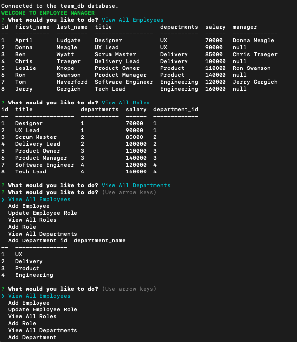

# 12_SQL_Employee-Tracker

# Description
This is a command line application built using Node, MySQL, Console.table and the Inquirer package to allow a user to manage employees, departments and roles that are stored in a database. 

# Acceptance Criteria
I wrote the  code to meet the following acceptance criteria:

* GIVEN a command-line application that accepts user input
* WHEN I start the application
* THEN I am presented with the following options: view all departments, view all roles, view all employees, add a department, add a role, add an employee, and update an employee role
* WHEN I choose to view all departments
* THEN I am presented with a formatted table showing department names and department ids
* WHEN I choose to view all roles
* THEN I am presented with the job title, role id, the department that role belongs to, and the salary for that role
* WHEN I choose to view all employees
* THEN I am presented with a formatted table showing employee data, including employee ids, first names, last names, job titles, departments, salaries, and managers that the employees report to
* WHEN I choose to add a department
* THEN I am prompted to enter the name of the department and that department is added to the database
* WHEN I choose to add a role
* THEN I am prompted to enter the name, salary, and department for the role and that role is added to the database
* WHEN I choose to add an employee
* THEN I am prompted to enter the employee’s first name, last name, role, and manager, and that employee is added to the database
* WHEN I choose to update an employee role
* THEN I am prompted to select an employee to update and their new role and this information is updated in the database 

# Installation

npm install to install required npm packages
Install Node.js to run application
Install MySQL to source Schema and seeds

# Usage
The user will log into MySQL and will enter SOURCE schema.sql then SOURCE seeds.sql
The application will initiate when the user enters npm start or node index.js in the command line
The user will be prompted with a list of the following choices:
* View All Roles
* View All Employees
* View All Departments
* Add Role
* Add Employee 
* Add Department
* Update Employee Role

# Screenshot

# Video Demo

[SQL Employee Tracker Recording.webm](https://user-images.githubusercontent.com/70189946/190280252-abb1b4e3-62c4-4af5-b52e-814bab2ac489.webm)
